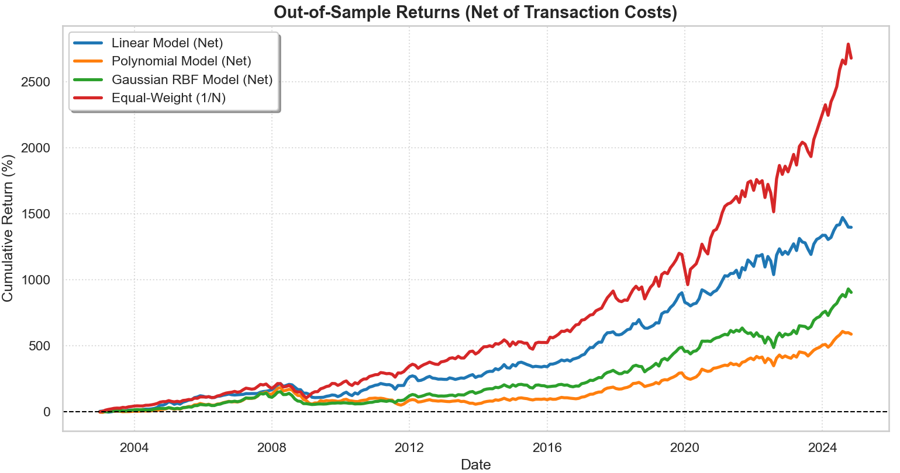
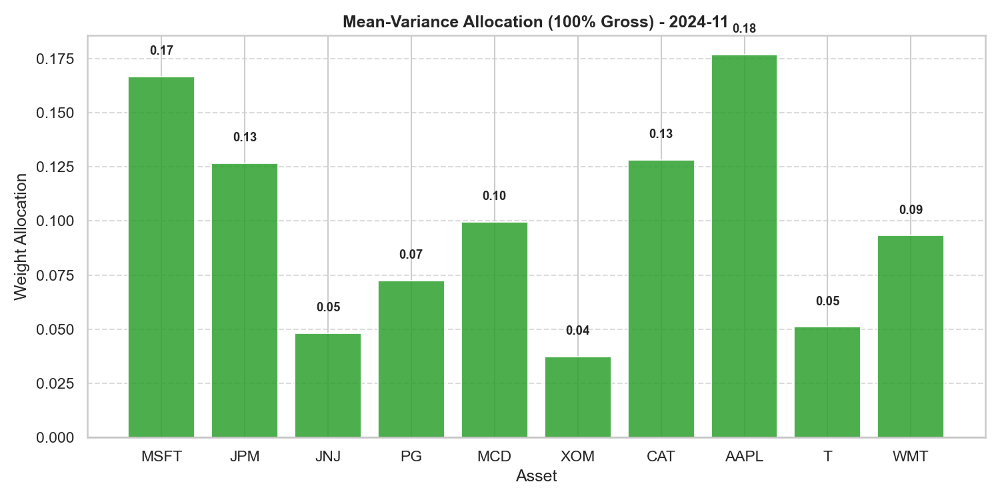
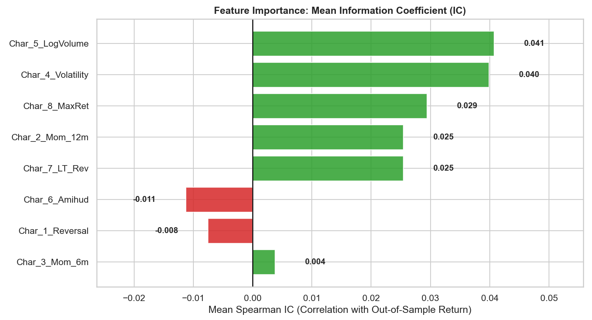

# Quantitative Asset Pricing: Kernel Ridge Regression & Mean-Variance Optimization


This repository contains a quantitative research pipeline for machine-learning-based stock return prediction and portfolio construction. It leverages **Kernel Ridge Regression (KRR)** models dynamically coupled with a **Mean-Variance Portfolio Optimizer**, rigorously evaluated out-of-sample over a 21-year period (2003–2024).

The core objective is to investigate whether machine-learning-based return signals translate into economically meaningful portfolio performance once turnover and transaction costs are taken into account.

---

## 📈 Key Quantitative Features

*   **Look-Ahead Bias Controls:** All predictive features (Momentum, Reversal, Volatility, Amihud Illiquidity, etc.) are constructed using information available at each time step and cross-sectionally standardized at time $t$.
*   **Walk-Forward Methodology:** Static train/test splits are abandoned in favor of a 120-month rolling window backtest, ensuring chronological time-series integrity.
*   **Friction-Aware Bayesian Optimization:** Hyperparameters ($\lambda, \gamma, c, d$) are dynamically tuned using the Tree-structured Parzen Estimator (TPE) via `Optuna`. Crucially, the optimization objective is the **Annualized Net Sharpe Ratio**, thereby incorporating the economic impact of portfolio turnover into model selection.
*   **Transaction Costs Accounting:** All out-of-sample portfolio allocations are evaluated strictly net of a realistic 10 basis points (0.10%) transaction cost per unit of turnover.
*   **100% Gross Exposure Normalization:** Portfolio weights are normalized such that the sum of absolute positions equals 100%, providing a consistent exposure scale across model specifications.

---

## 📊 Empirical Results (2003 - 2024)

The Walk-Forward backtest highlights a clear *bias-variance tradeoff* in the presence of market frictions. Within each 10-year rolling training window, the highly flexible non-linear Polynomial model exhibits substantially higher portfolio turnover (69.40% / mo) and weaker net risk-adjusted performance. The **Linear Kernel** delivers the strongest out-of-sample risk-adjusted performance among the tested KRR specifications, suggesting that the additional flexibility of non-linear kernels does not translate into superior portfolio performance in this setting.

*Performance is evaluated strictly net of 10 bps transaction costs on a universe of 10 U.S. mega-cap equities.*

| Model | Gross Return | Net Return | Ann. Net Sharpe | Annual Volatility | Mean Turnover |
| :--- | :--- | :--- | :--- | :--- | :--- |
| **Linear Kernel** | 1628.67% | **1396.80%** | **1.0121** | 13.10% | 55.27% / mo |
| **Polynomial Kernel** | 723.60% | 586.72% | 0.6987 | 14.04% | 69.40% / mo |
| **Gaussian RBF** | 1055.07% | 903.38% | 0.8661 | 13.21% | 53.93% / mo |
| *Equal-Weight (1/N)* | *-* | *2679.07%* | *1.2055* | *13.41%* | *0.00% / mo* |

> **Note on Benchmark Dominance:** The strong performance of the $1/N$ benchmark should be interpreted in light of *survivorship bias*: the investment universe consists of a static set of ex-post selected mega-cap equities. This creates a favorable environment for the passive benchmark and may disadvantage active long/short strategies, particularly when stocks that experienced strong long-term appreciation are included in the investment universe throughout the entire sample period.
---

## 📈 Performance Visualization







## 📄 Research Report

A detailed discussion of the mathematical framework, methodology, and empirical results is available in the accompanying research report.

[📄 Read the full research report](Report.pdf)

---

## 📁 Repository Structure

```text
├── src/
│   ├── __init__.py
│   ├── data_loader.py    # yfinance download, feature engineering, and cross-sectional scaling
│   ├── models.py         # Custom implementation of Panel-Data Kernel Ridge Regression
│   ├── portfolio.py      # Mean-Variance optimization, Gross Exposure logic, and Turnover tracking
│   ├── backtest.py       # Walk-Forward rolling window and Optuna TPE integration
│   └── visualization.py  # Matplotlib/Seaborn graphics and performance metric calculations
├── main.py               # Main execution pipeline
├── Report.pdf            # Comprehensive LaTeX academic paper detailing the mathematical framework
└── README.md 
``` 

## 🚀 How to Run

1. Clone the repository and install the required dependencies (`pandas`, `numpy`, `yfinance`, `optuna`, `matplotlib`, `seaborn`).
2. Run the main pipeline from the terminal:
```bash
   python main.py
```
3. The script will dynamically download data from Yahoo Finance, run the 21-year rolling optimizations, display the analytical charts (Cumulative Returns, Factor IC, Portfolio Weights), and print the final net performance summary.

---

<sub>
⚠️ <strong>Disclaimer:</strong> This project is intended for academic and research purposes only. The results are based on historical data and should not be interpreted as investment advice or as an indication of future performance.
</sub>

---

**Author:** Antonio Gabriele Santini | *MSc Quantitative Finance* | *University of Turin*
